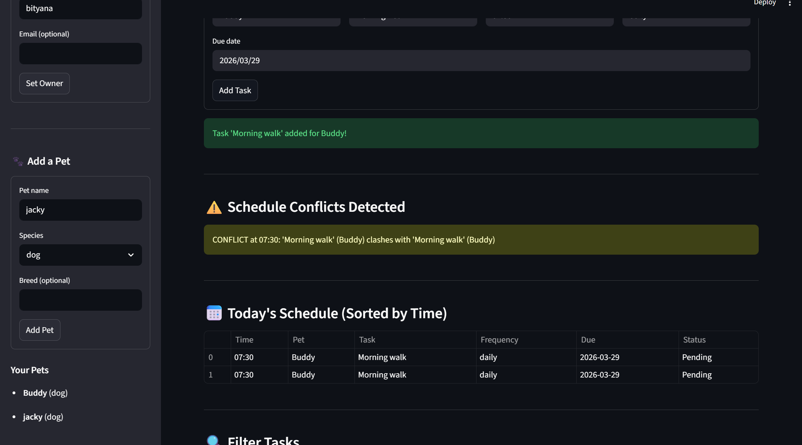

# PawPal+ — Smart Pet Care Management System

**PawPal+** is a Python + Streamlit application that helps pet owners plan, schedule, and track daily care tasks for their pets — walks, feedings, medications, appointments, and more.

---

## Scenario

A busy pet owner needs help staying consistent with pet care. They want an assistant that can:

- Track pet care tasks (walks, feeding, meds, enrichment, grooming, etc.)
- Consider constraints (time, recurrence, scheduling conflicts)
- Produce a sorted daily plan and warn about conflicts
- Let them mark tasks complete with automatic rescheduling for recurring items

---

## System Architecture

The app is split into two layers:

| File | Role |
|---|---|
| `pawpal_system.py` | Backend logic — all Python classes |
| `app.py` | Streamlit UI — connects to the logic layer |
| `main.py` | CLI demo — verifies backend in the terminal |
| `tests/test_pawpal.py` | Automated pytest suite |

### Classes (UML → see `uml_final.md`)

- **Task** — a single care activity with `description`, `time` (HH:MM), `frequency` (once/daily/weekly), `completed`, and `due_date`. Handles its own recurrence via `mark_complete()`.
- **Pet** — stores pet info and a list of Tasks. Exposes `add_task()` and `get_tasks()`.
- **Owner** — manages multiple Pets. Provides `get_all_tasks()` returning `(Pet, Task)` tuples.
- **Scheduler** — the algorithmic brain. Operates on the Owner to sort, filter, detect conflicts, and manage task completion.

---

## Features

### Core Features
- **Add pets** — register dogs, cats, rabbits, or any animal under an owner profile
- **Schedule tasks** — assign care activities to specific pets with a time, frequency, and due date
- **Today's schedule** — view all pending tasks sorted chronologically

### Smarter Scheduling

PawPal+ goes beyond a simple task list with four intelligent features:

| Feature | Description |
|---|---|
| **Sorting by time** | All tasks are sorted chronologically using `Scheduler.sort_by_time()`. Implemented with Python's `sorted()` and a `lambda key` on the HH:MM time string. |
| **Filtering** | Filter the schedule by pet name, completion status (Pending / Done), or any combination. Implemented in `Scheduler.filter_tasks()`. |
| **Daily recurrence** | Marking a "daily" or "weekly" task complete automatically creates the next occurrence using Python's `timedelta`. The new task is appended to the pet's task list with `due_date + 1 day` (daily) or `due_date + 7 days` (weekly). |
| **Conflict warnings** | `Scheduler.detect_conflicts()` scans all incomplete tasks and flags any two tasks scheduled at the exact same time. Warnings appear prominently in the Streamlit UI using `st.warning()`. |

### UI Highlights
- Sidebar for owner and pet setup, persisted in `st.session_state`
- Task form with time validation
- Conflict warning banner (orange `st.warning`)
- Today's schedule as a clean `st.table`
- Filter controls for pet name and status
- One-click task completion with auto-reschedule confirmation (`st.success`)

---

## Getting Started

### Setup

```bash
python -m venv .venv
source .venv/bin/activate   # Windows: .venv\Scripts\activate
pip install -r requirements.txt
```

### Run the CLI demo

```bash
python main.py
```

### Run the Streamlit app

```bash
streamlit run app.py
```

---

## Testing PawPal+

Run the full test suite with:

```bash
python -m pytest
```

Or with verbose output:

```bash
python -m pytest tests/ -v
```

### What the tests cover

| Test | Behavior Verified |
|---|---|
| `test_task_completion_changes_status` | `mark_complete()` sets `completed = True` |
| `test_task_addition_increases_pet_task_count` | `Pet.add_task()` grows the task list |
| `test_sort_by_time_returns_chronological_order` | Tasks come back in HH:MM order |
| `test_sort_by_time_with_single_pet` | Sorting works with one pet |
| `test_daily_task_creates_next_day_occurrence` | Daily recurrence adds tomorrow's task |
| `test_weekly_task_creates_next_week_occurrence` | Weekly recurrence adds next week's task |
| `test_once_task_does_not_create_recurrence` | One-time tasks don't auto-spawn |
| `test_conflict_detected_for_same_time_different_pets` | Cross-pet time conflicts flagged |
| `test_conflict_detected_same_pet_same_time` | Same-pet time conflicts flagged |
| `test_no_conflict_with_different_times` | Distinct times produce no warnings |
| `test_completed_tasks_do_not_trigger_conflicts` | Done tasks are ignored in conflict scan |
| `test_owner_with_no_pets_returns_empty_schedule` | Empty owner handled gracefully |
| `test_pet_with_no_tasks_returns_empty` | Pet with no tasks handled gracefully |
| `test_filter_by_pet_name` | Filter returns only the named pet's tasks |
| `test_filter_by_completed_status` | Filter correctly splits done/pending |

**Confidence Level: ⭐⭐⭐⭐ (4 / 5)** — All 15 tests pass. Core algorithms are solid. Would add duration-based overlap detection and persistence testing in a future iteration.

---

## 📸 Demo

> **Screenshot instructions:** Run `streamlit run app.py`, add an owner, add two pets, add several tasks (including two at the same time to trigger a conflict warning), then take a screenshot of the full app window. Save it as `demo_screenshot.png` and embed it here.

<!-- Replace the path below with your actual screenshot after capturing it -->
<!--  -->

---

## Suggested Workflow (for graders)

1. `python main.py` — verify CLI backend output (sorting, filtering, conflict, recurrence)
2. `python -m pytest tests/ -v` — run 15 automated tests (all should pass)
3. `streamlit run app.py` — explore the full interactive UI

---

## Project Info

- **Course:** AI110 — Foundations of AI Engineering (CodePath, Spring 2026)
- **Module:** 2 — Object-Oriented Design + Algorithmic Scheduling
- **Stack:** Python 3, Streamlit, pytest, dataclasses, datetime
