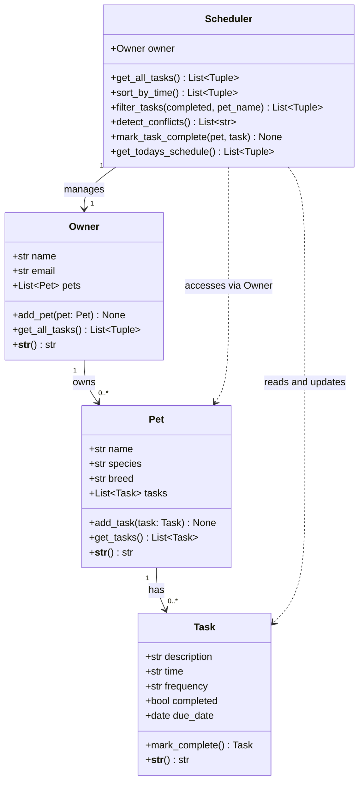

# PawPal+ — Final UML Class Diagram (Mermaid.js)

Paste the code block below into https://mermaid.live to render and screenshot as `uml_final.png`.

## Relationships Explained

| Relationship | Description |
|---|---|
| Owner → Pet | An owner can have zero or more pets (composition) |
| Pet → Task | A pet has zero or more tasks (composition) |
| Scheduler → Owner | Scheduler is initialized with one Owner (association) |
| Scheduler ⇢ Pet | Scheduler accesses pets indirectly through Owner |
| Scheduler ⇢ Task | Scheduler reads/updates tasks via the pet-task chain |

## Design Notes

- **Task** uses `mark_complete()` to return the next occurrence for recurring tasks (daily/weekly).
  This keeps recurrence logic self-contained in the Task class.
- **Scheduler** acts as a pure service layer — it holds no task data itself, only references Owner.
- **Owner.get_all_tasks()** returns `(Pet, Task)` tuples so the Scheduler always knows
  which pet a task belongs to (required for conflict detection and filtering).
